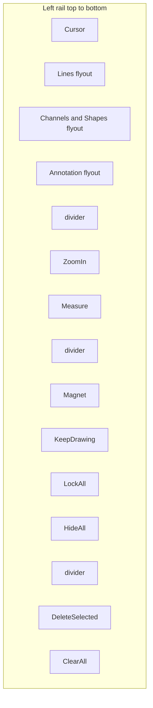
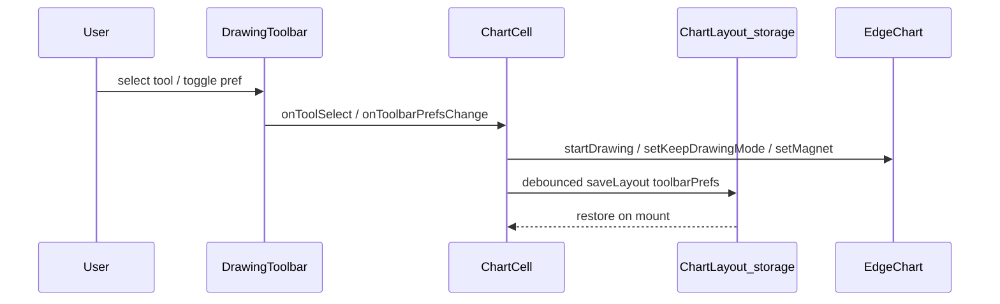

# Drawing Toolbar Design

Design specification for Edge Chart's TradingView-style left drawing rail: grouped flyouts, utilities, icon system, state persistence, and phased parity roadmap.

**Related docs:** [tradingview-reference.md](./tradingview-reference.md) §6 (taxonomy source of truth), [drawing-engine-design.md](./drawing-engine-design.md) (FSM, plugin registry, alias map), [features.md](./features.md) (implementation status).

---

## 1. Toolbar anatomy

The left rail in `ChartCell` is ordered top-to-bottom:

| Section | Items | Behavior |
|---------|-------|----------|
| **Cursor** | Crosshair | Disarms drawing; returns to selection/navigation mode |
| **Drawing groups** | Lines, Channels & Shapes, Annotation, Forecasting | Flyout menus; group button shows last/active tool icon |
| **Utilities** | Zoom in, Measure | Single-click actions (Measure arms drawing tool in Phase 1) |
| **Workflow toggles** | Magnet, Keep drawing, Lock all, Hide all | Toggle buttons; state persisted in layout |
| **Destructive** | Delete selected, Clear all | Delete selected appears only when a drawing is selected |



**Implementation:** [`DrawingToolbar.tsx`](../src/app/components/DrawingToolbar.tsx), [`DrawingToolGroup.tsx`](../src/app/components/DrawingToolGroup.tsx), [`toolGroups.ts`](../src/app/components/chart-icons/toolGroups.ts).

---

## 2. Group taxonomy vs TradingView §6.2–6.9

Edge implements a **subset** of TV's 110+ tools via three flyout groups plus standalone slots. Status column: **Have** = shipped, **Phase N** = planned, **Omit** = out of scope.

| TV section | Edge group / slot | Tools | Status |
|------------|-------------------|-------|--------|
| §6.1 Cursors | Cursor button | Crosshair | **Have** — dot, arrow, eraser **Omit V3** |
| §6.2 Lines | `lines` | Trend line, horizontal line, vertical line, ray, price line | **Have** — horizontal ray, cross line, info line **Phase 2** |
| §6.2 Channels | `shapes` (partial) | Parallel channel, price channel | **Have** — pitchforks, regression **Phase 3** |
| §6.3 Fibonacci / Gann | `shapes` | Fib retracement | **Have (1)** — fan, arc, time zone **Phase 3** |
| §6.4 Patterns | — | — | **Omit V3** |
| §6.5 Forecasting | `forecasting` | Long position, short position | **Have (2)** — forecast, bars pattern **Omit V3**; date/price range measurers **Phase 2** |
| §6.6 Geometric shapes | `shapes` | Rectangle, circle | **Have** — brush, highlighter **Phase 2** |
| §6.7 Annotation | `annotation` | Text | **Have** — note, callout, pin **Phase 3** |
| §6.8 Icons | — | — | **Omit V3** |
| §6.9 Standalone utilities | Utilities rail | Zoom in, Measure | **Have** |
| §6.10 Workflow | Utilities rail | Magnet, keep drawing, lock all, hide all, delete, clear | **Partial** — undo/redo **Phase 3** |

**Measure placement:** TV lists Measure under §6.9 standalone utilities (alongside Zoom in), not inside annotation groups. Edge follows this: Measure is a top-level utility button. Phase 1 keeps Measure as a persisted drawing plugin; Phase 2 makes it ephemeral (auto-clear after read).

---

## 3. Flyout interaction spec

### 3.1 Open

| Input | Behavior |
|-------|----------|
| `(pointer: fine)` desktop | `mouseenter` on group container opens flyout; 120 ms grace on `mouseleave` before close |
| `(pointer: coarse)` touch / tablet | First tap on group button **pins** flyout open; does **not** arm tool |
| Keyboard | Group button focusable; `Enter` / `Space` toggles pin; `ArrowDown` moves focus into menu |

Only one flyout open at a time (`openGroupId` in toolbar).

### 3.2 Close

| Input | Behavior |
|-------|----------|
| Fine pointer | Mouse leave from group + flyout panel; 120 ms delayed close |
| Pinned (coarse / keyboard) | Tap outside (`pointerdown` capture on document), `Escape`, or after tool selection |
| Tool selection | Always closes flyout and arms selected tool |

### 3.3 Group button click

| Context | Behavior |
|---------|----------|
| Fine pointer, flyout closed | Arm `selectedTool` (last-used tool in group) |
| Coarse pointer, flyout pinned | Toggle pin only (first tap); arm on menu item select |
| Active state | `#2A2E39` background when any tool in group is `activeTool` |
| Rail icon | Shows active tool icon when armed; otherwise last selection |

### 3.4 Accessibility

- Group button: `aria-haspopup="menu"`, `aria-expanded={isOpen}`, `aria-label` from active or selected tool label
- Flyout panel: `role="menu"`
- Menu items: `role="menuitemradio"`, `aria-checked={isActive}`

---

## 4. Icon system

Single source of truth for SVG markup:

| Layer | Path | Notes |
|-------|------|-------|
| Markup | [`iconPaths.ts`](../src/app/components/chart-icons/iconPaths.ts) | `viewBox="0 0 28"`, stroke `1.25`, anchor circles `r=1.75` |
| React | [`ChartToolIcons.tsx`](../src/app/components/chart-icons/ChartToolIcons.tsx) | `<ChartIcon id=… size={n} />` wrappers |
| Export | [`scripts/export-chart-icons.ts`](../scripts/export-chart-icons.ts) | Writes standalone SVGs to `public/icons/chart/` |

**Color tokens (TradingView dark rail):**

| State | Background | Foreground |
|-------|------------|------------|
| Rail | `#131722` (`--edge-surface-rail`) | — |
| Idle | transparent | `#BBBDC2` (`--edge-text-rail`) |
| Hover | `#2A2E39` | `#E8EAEE` (`--edge-text-rail-active`) |
| Active | `#2A2E39` | `#E8EAEE` (`--edge-text-rail-active`) |
| Flyout panel | `#131722` | border `#1E222D` |

**Display sizes:** default rail icons 22 px; compact 20 px. Button hit targets: 36×36 px default (`h-9 w-9`), 32×32 px when `compact={true}` (`h-8 w-8`). Rail width: 44 px default, 40 px compact — shared with the right sidebar icon rail.

Run export: `node --experimental-strip-types scripts/export-chart-icons.ts`

---

## 5. State model

### 5.1 Types

```ts
type ToolbarPrefs = {
  groupSelections?: Record<string, DrawingToolName>; // lines | shapes | annotation
  keepDrawing?: boolean;  // default false (TV: return to cursor after place)
  magnet?: boolean;       // default false
};

// On ChartLayout
toolbarPrefs?: ToolbarPrefs;
```

### 5.2 Ownership

| State | Scope | Persisted | Default |
|-------|-------|-----------|---------|
| `activeTool` | Per cell, runtime | No | `__cursor__` |
| `groupSelections` | Layout | Yes (`toolbarPrefs`) | Group `defaultTool` values |
| `magnet`, `keepDrawing` | Layout | Yes (`toolbarPrefs`) | `false` |
| `allLocked`, `allHidden` | Derived from overlays | No (overlay flags in `CellConfig.drawings`) | — |

Persistence: `StockApp` → `saveLayout` / `loadLayout` via [`layoutStorage.ts`](../src/lib/layoutStorage.ts) (500 ms debounce).

### 5.3 Flow



Toolbar names map to registry keys via [`pluginHost.ts`](../src/lib/chart/pluginHost.ts) `drawingAliases`.

---

## 6. Phased roadmap

### Phase 1 — polish (current)

- Design doc + sync `features.md` / `drawing-engine-design.md`
- Measure → utilities rail; annotation group solo (text only)
- Touch flyout (click-to-pin + outside dismiss)
- `ChartLayout.toolbarPrefs` persistence
- Keep-drawing default **OFF**
- Compact rail: 40×40 buttons when multi-chart grid
- Unit tests: `toolGroups`, `DrawingToolGroup`

### Phase 2 — tools

- Line variants: horizontal ray, cross line, info line
- Brush, highlighter
- Date range, price range measurers
- Ephemeral measure (auto-remove after dismiss)

### Phase 3 — workflow parity

- Undo/redo stack for drawings
- Cursor modes (dot, arrow), pitchforks, pattern templates
- Magnet strong/weak + snap-to-indicator
- Favorites/recent tools, multi-layout drawing sync

---

## 7. Verification checklist

```bash
npm test -- --run
node --experimental-strip-types scripts/export-chart-icons.ts
```

Manual:

- [ ] Hover each flyout (desktop); pin/dismiss under touch emulation
- [ ] Measure on utilities rail arms measure tool
- [ ] Reload: last group tool icons restored from layout
- [ ] Place drawing with keep-drawing OFF → cursor returns
- [ ] Toggle keep-drawing ON → persists across reload
- [ ] Compact grid: shorter rail; flyouts render over chart pane
