# Day Classification — Visual Reference Pack

**Real chart images** downloaded from educational sources (Market Profile day types + open types + gaps). Open this file in **Markdown Preview** so the pictures render.

Sources credited under each image. Images live in [`assets/references/`](./assets/references/).

---

## L1 — Day types (Market Profile charts)

Labeled TPO charts from [L1 day-type gather](47439d4c-c8af-49b1-96e6-cb561b522f79): Marketcalls (trend, non-trend) + [BellTPO Knowledge Hub](https://belltpo.com/knowledge-hub/) (normal, normal variation, double distribution, neutral).

### Overview — six day types

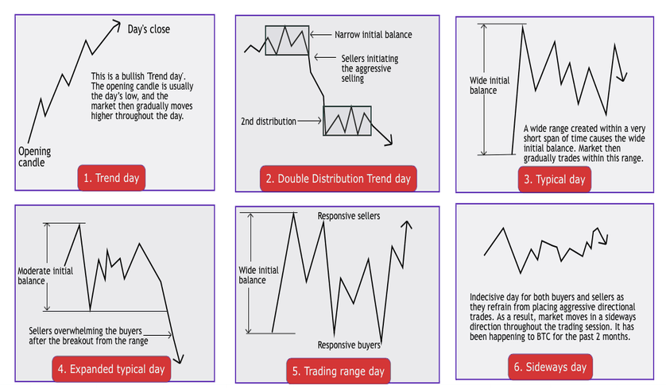

Source: [Time ▾ Price ▴ Research / Dalton](https://time-price-research-astrofin.blogspot.com/2023/03/six-types-of-market-days-mind-over.html)

---

### `non_trend`

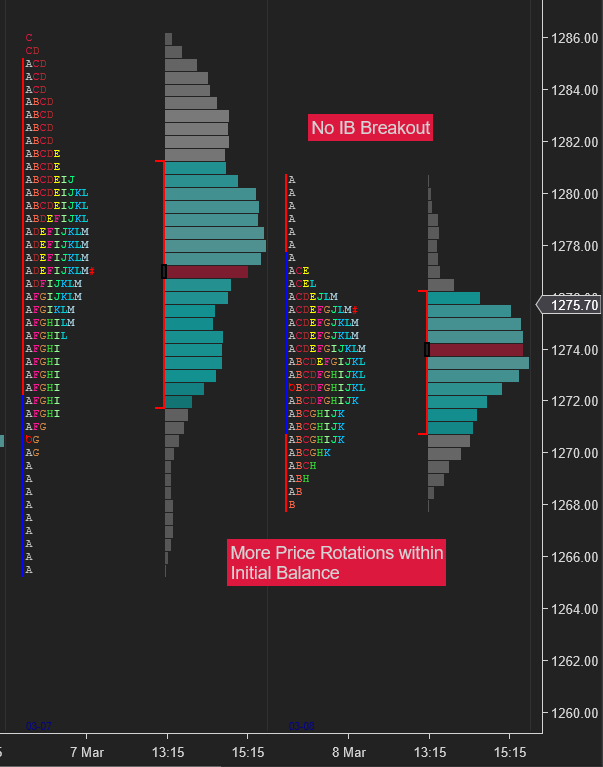

Narrow range, balance, dull participation.

Source: [Marketcalls — Profile Days](https://www.marketcalls.in/market-profile/market-profile-different-types-of-profile-days.html)

---

### `normal`

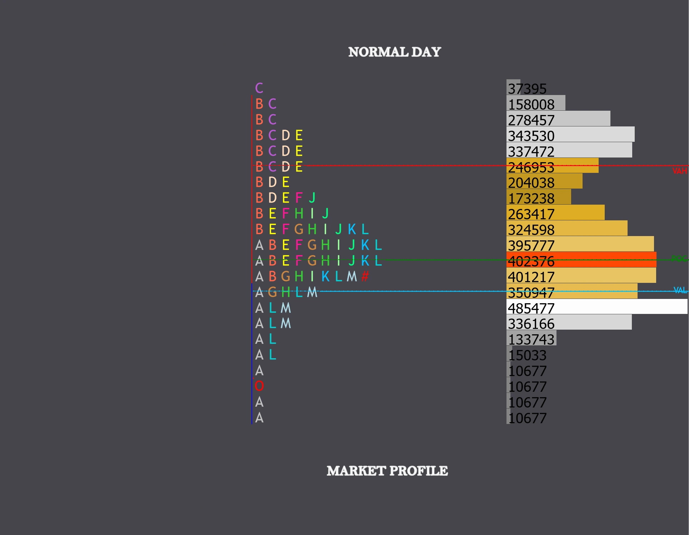

Wider initial balance; rotation around center / POC; bell shape.

Source: [BellTPO](https://belltpo.com/knowledge-hub/)

---

### `normal_variation`

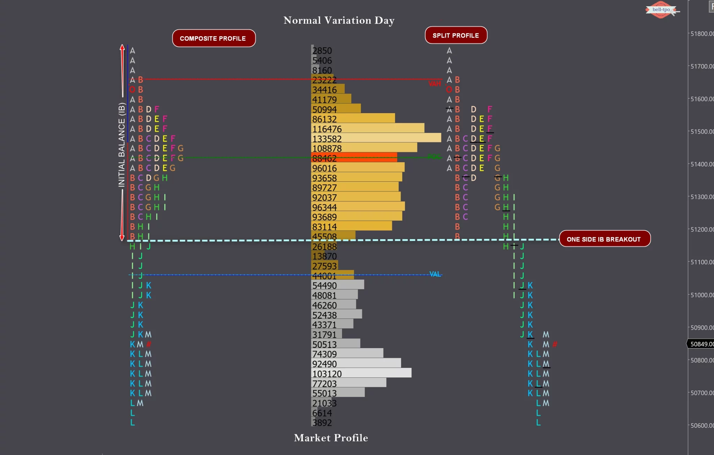

Smaller IB, then range extension (~2× IB) later in the session.

Source: [BellTPO](https://belltpo.com/knowledge-hub/)

---

### `trend`

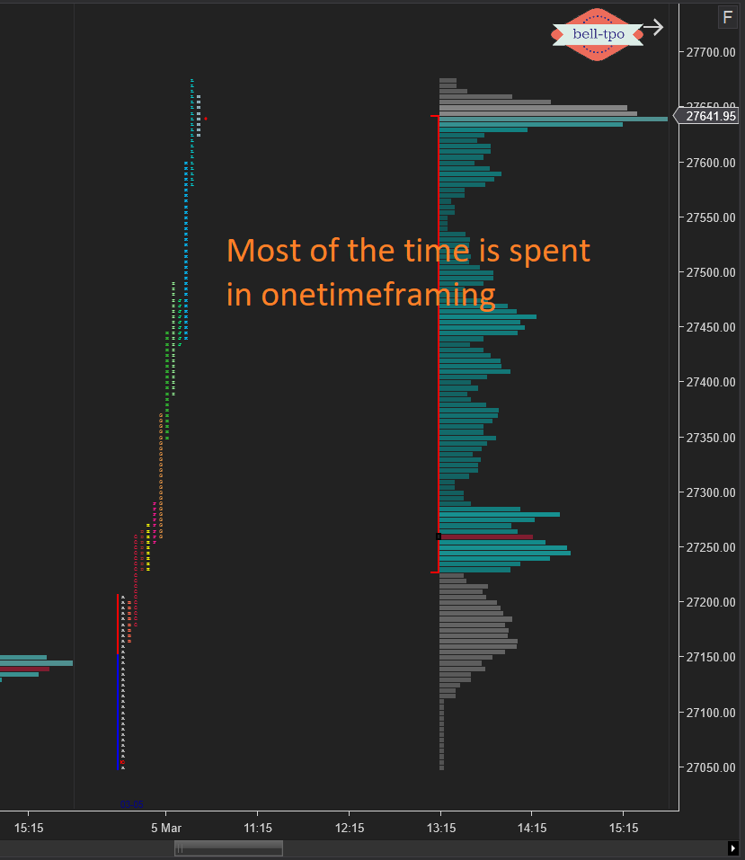

Vertical / elongated; one-timeframe; little rotation; close near extreme.

Source: [Marketcalls](https://www.marketcalls.in/market-profile/market-profile-different-types-of-profile-days.html)

---

### `double_distribution`

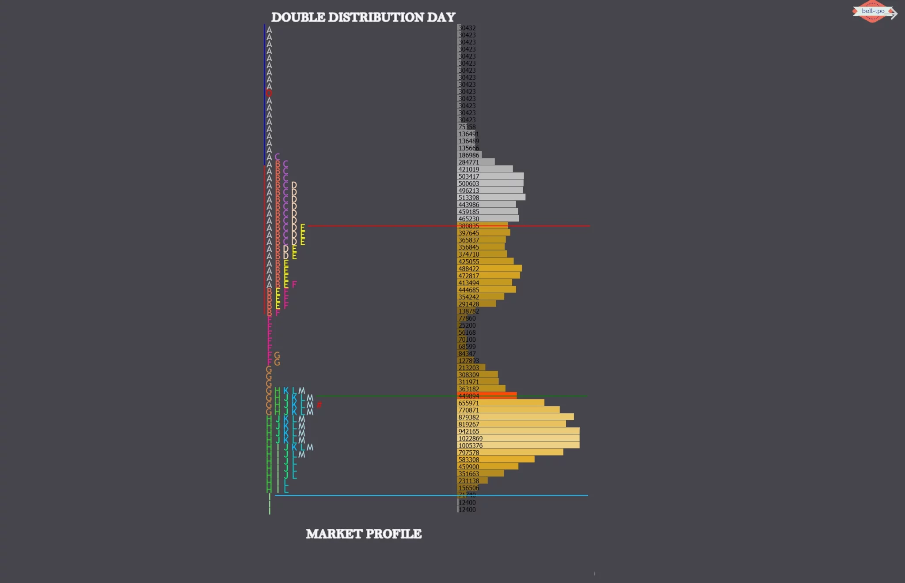

Two balance regions separated by single prints (balance → break → new balance).

Source: [BellTPO](https://belltpo.com/knowledge-hub/)

---

### `neutral` (center)

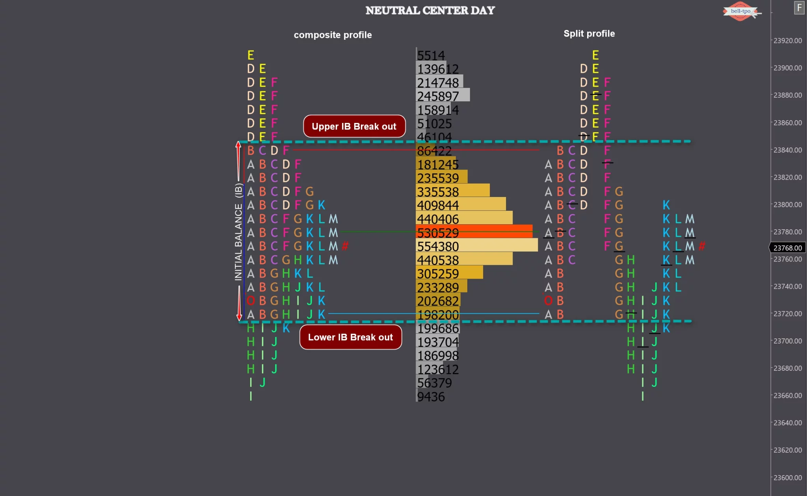

IB breaks both sides; close mid-profile.

Source: [BellTPO](https://belltpo.com/knowledge-hub/)

---

### `neutral` (extreme)

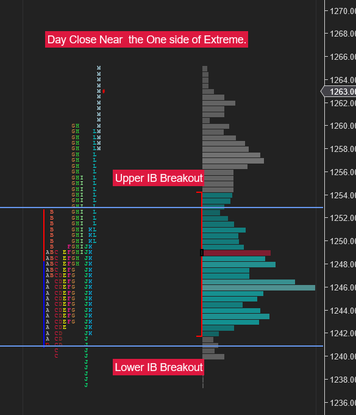

IB breaks both sides; close at one extreme (common on event days).

Source: [BellTPO / Marketcalls](https://belltpo.com/knowledge-hub/)

---

## L2 — Open types

### Overview

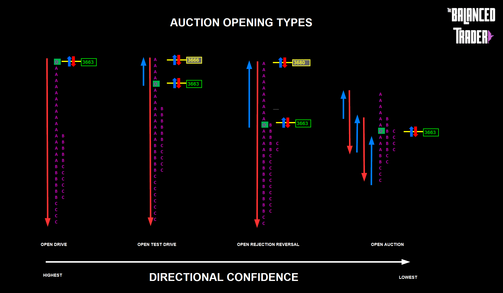

Source: [Trading Balance — Opening Types](https://tradingbalance.co.uk/market-profile-opening-types-and-how-to-use-the-information-to-trade-successfully/)

---

Annotated candle/volume-profile examples from [ParaCurve — Day Opening Types](https://paracurve.com/2020/02/day-opening-types.html) (gathered by [L2 open-type gather](c739935d-28ab-4d54-a809-24f2c2489bb9)).

### `open_drive`

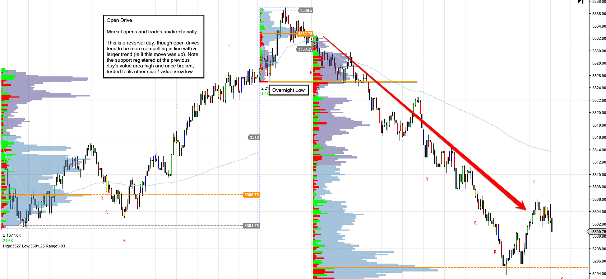

Immediate directional acceptance from the open.

---

### `open_test_drive`

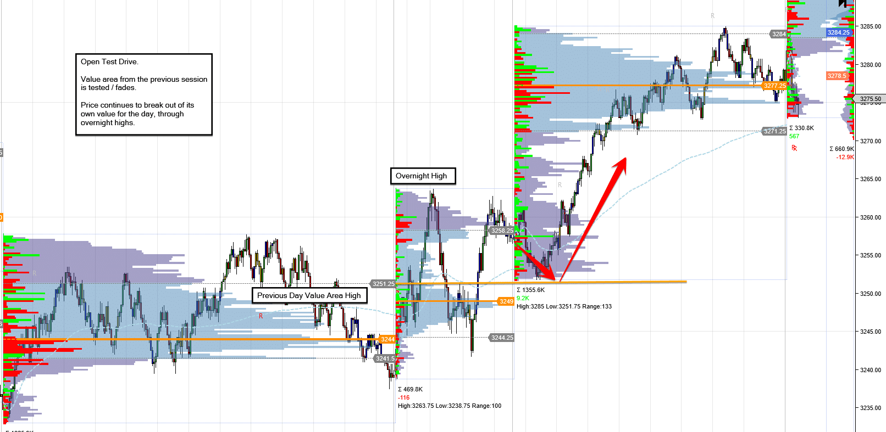

Probe opposite, then drive.

---

### `open_rejection_reverse`

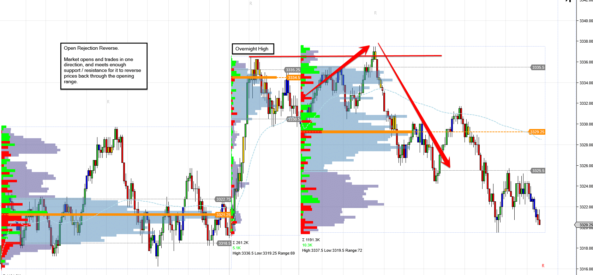

Drive fails → reverses hard.

---

### `open_auction`

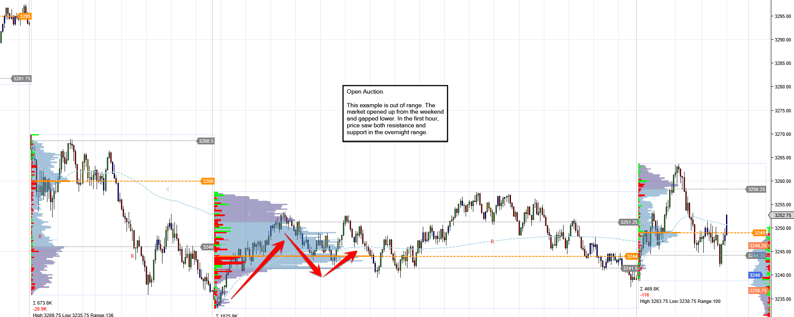

Rotation / two-sided trade near the open (no clean drive).

---

## L3a — Gaps

Candlestick examples from [L3 gap gather](3dc0299b-810b-4b0b-94a4-3ca4486c5645).

### Gap types overview

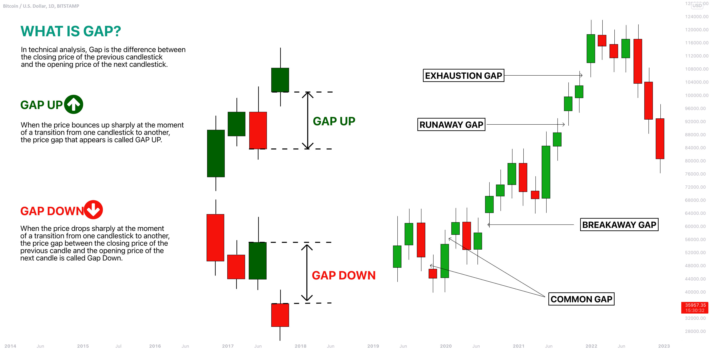

Source: [TradingView — Gap types](https://www.tradingview.com/chart/BTCUSD/MUy8fjrG-What-is-a-Gap-in-Trading-Different-Types-of-Gaps-Explained/)

---

### `gap_and_go`

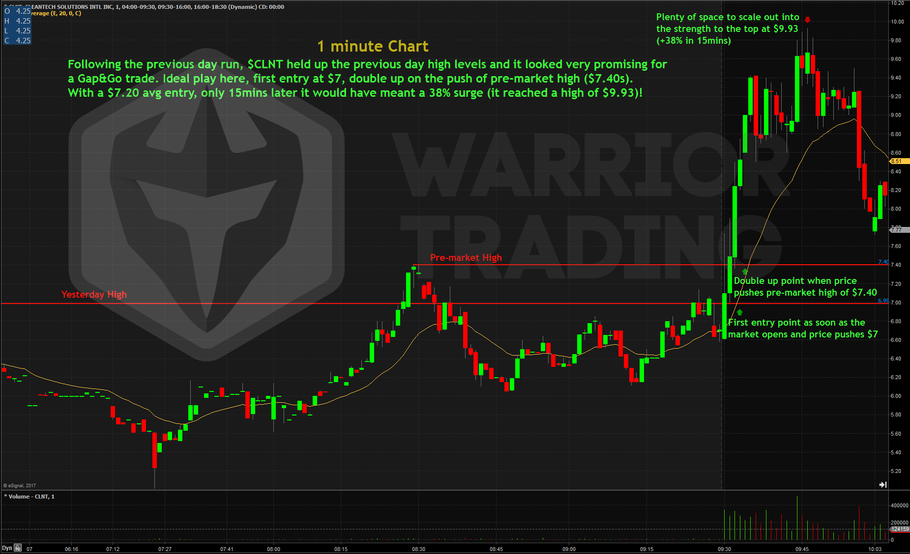

Gap holds; continues in gap direction (no fill).

Source: [Warrior Trading — Gap and Go](https://www.warriortrading.com/gap-go/)

---

### `gap_fill`

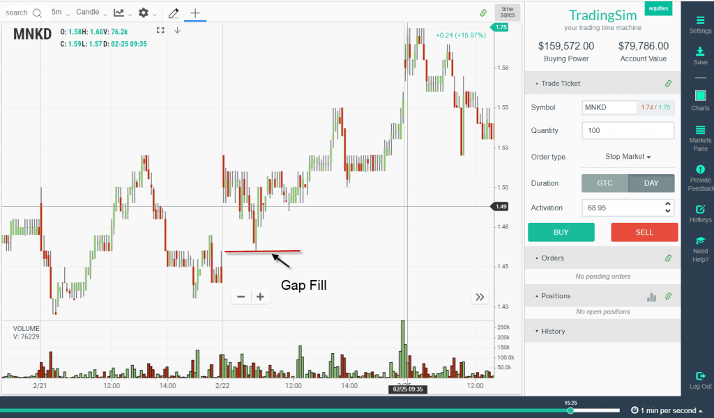

Price trades back through prior close.

Source: [TradingSim — Morning Reversal Gap Fill](https://www.tradingsim.com/blog/morning-reversal-gap-fill)

---

### `gap_and_fade`

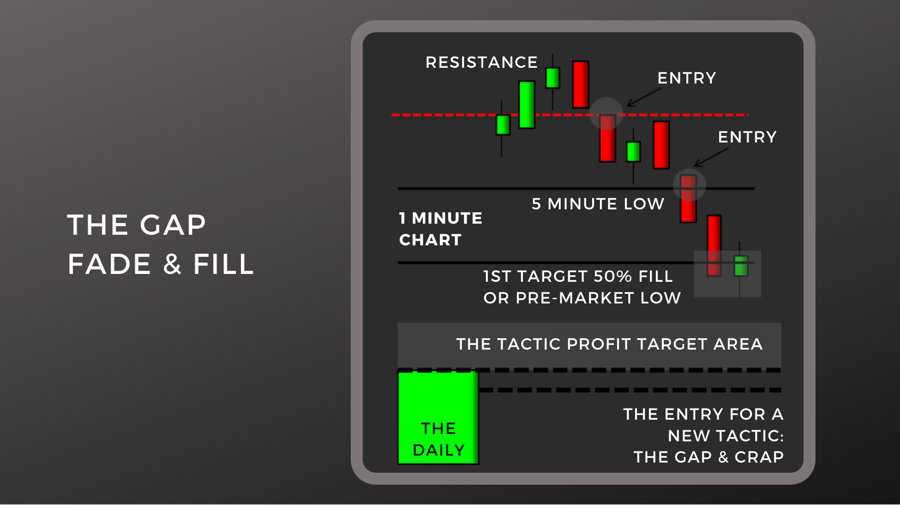

Gaps, then reverses (fade / fill path).

Source: [Learning Day Trading — Gap Fade and Fill](https://learningdaytrading.com/the-gap-fade-and-fill/)

---

### `gap_partial`

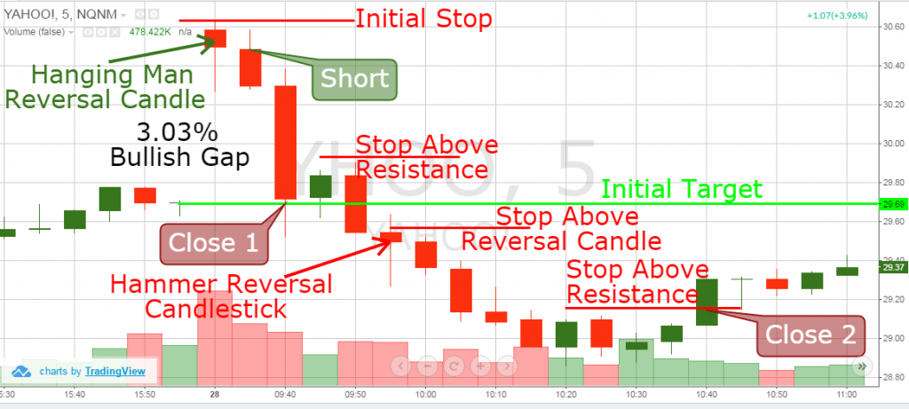

Touches into the gap / staged targets without a clean full fill only.

Source: [TradingSim](https://www.tradingsim.com/blog/morning-reversal-gap-fill)

---

### `gap_none`

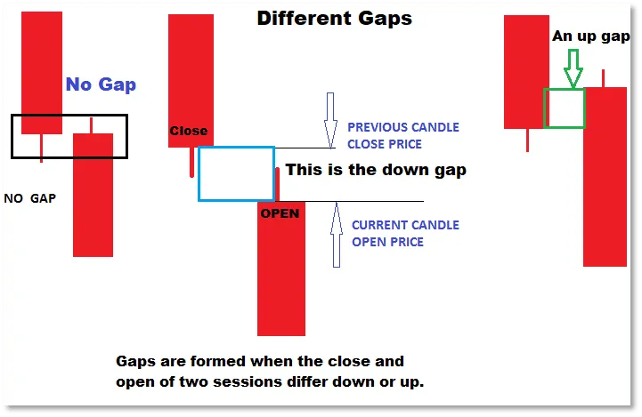

Open near prior close (schematic comparison).

---

## How to use this with your batch

1. Open this guide in Markdown Preview (images must be visible).
2. Study one label’s picture.
3. Open the matching homework day in Edge (`1D` then `5m`).
4. Decide if your day matches the picture; edit the CSV.

Homework CSV: `data/day-profiles/proposed/batch-20260718.csv` — Phase 1 store after human review (`status=confirmed`; `dayTypeHint` holds final L1; `openType` filled from RTH 5m review).
